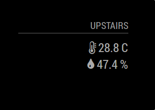

# MMM-DHT-Sensor

This a module for the [MagicMirror](https://github.com/MichMich/MagicMirror).

This module gets data form DHT11, DHT22 and AM2302 sensors.



## bcm2835

This module uses [node-dht-sensor](https://github.com/momenso/node-dht-sensor) to get the sensor data, and this module depends on [bcm2835](http://www.airspayce.com/mikem/bcm2835/) to do so, therefore you need to install it in your Pi in order to use this module.

```bash
cd ~
wget http://www.airspayce.com/mikem/bcm2835/bcm2835-1.52.tar.gz
tar zxvf bcm2835-1.52.tar.gz
cd bcm2835-1.52
./configure
make
sudo make check
sudo make install
```

## Installation

```bash
git clone https://github.com/ryck/MMM-DHT-Sensor.git
cd MMM-DHT-Sensor
npm install
```

## Config

The entry in `config.js` can include the following options:

| Option             | Description                                                                                                                                                                                                                                           |
| ------------------ | ----------------------------------------------------------------------------------------------------------------------------------------------------------------------------------------------------------------------------------------------------- |
| `sensorPin`        | **Required** This is the GPIO pin the sensor is connected to. **Note:** This is not the hardware pin number.<br><br>**Type:** `integer`<br>                                                                                                           |
| `sensorType`       | **Required** This is the the sensor type. It should work for DHT11, DHT22 and AM2302 sensors<br><br>**Type:** `integer`<br> **Possible values:** `11` for DHT11 or `22` for DHT22 / AM2302                                                            |
| `units`            | What units to use. Specified by config.js <br><br>**Type:** `string`<br>**Possible values:** config.units = Specified by config.js, `metric` = Celsius, `imperial` =Fahrenheit <br> **Default value:** `config.units`                                 |
| `updateInterval`   | How often the sendor data is updated.<br><br>**Type:** `integer`<br>**Default value:** `1 hour`                                                                                                                                                       |
| `relativeScale`    | Relative scale to choose the temparature icon.<br><br>**Type:** `integer`<br>**Default value:** `30`                                                                                                                                                  |
| `initialLoadDelay` | The initial delay before loading. If you have multiple modules that use the same API key, you might want to delay one of the requests. (Milliseconds) <br><br>**Type:** `integer`<br>**Possible values:** `1000` - `5000` <br> **Default value:** `0` |
| `animationSpeed`   | Speed of the update animation. (Milliseconds) <br><br>**Type:** `integer`<br>**Possible values:**`0` - `5000` <br> **Default value:** `1000` (1 second)                                                                                               |
| `debug`            | Show debug information. <br><br> **Possible values:** `true` or `false` <br> **Default value:** `false`                                                                                                                                               |

Here is an example of an entry in `config.js`

```
{
	module: "MMM-DHT-Sensor",
	position: "top_right",
	header: "Upstairs",
	config: {
		sensorPin: 2,
		sensorType: 22,
		updateInterval: 60 * 60 * 1000,
		initialLoadDelay: 0,
		animationSpeed: 1000,
		units: "metric",
		relativeScale: 35,
		debug: false
	}
},
```

## Notes

- A good resource to know the GPIO/Hardware pin number is (https://pinout.xyz/)

## Notifications

This module implements the following notifications:

- **INDOOR_TEMPERATURE** (int) Temperature in Celsius
- **INDOOR_HUMIDITY** (int) Humidity in relative humidity (%)

## Dependencies

- [bcm2835](http://www.airspayce.com/mikem/bcm2835/)
- [node-dht-sensor](https://github.com/momenso/node-dht-sensor) (installed via `npm install`)

## Issues

```
WARNING! Could not load config file. Starting with default configuration. Error found: Error: The module '/home/pi/MagicMirror/modules/MMM-DHT-Sensor/node_modules/node-dht-sensor/build/Release/node_dht_sensor.node'
was compiled against a different Node.js version using
NODE_MODULE_VERSION 48. This version of Node.js requires
NODE_MODULE_VERSION 53. Please try re-compiling or re-installing
the module (for instance, using `npm rebuild` or`npm install`).
```

If you get this error after installing the module (or your MagicMirror is just a black screen) try this:

```bash
cd MMM-DHT-Sensor
npm install electron-rebuild
./node_modules/.bin/electron-rebuild
```

## Thanks To...

- [Cato Antonsen](https://github.com/prasanthsasikumar) for the [MMM-Temperature-Humidity](https://github.com/prasanthsasikumar/MMM-Temperature-Humidity) module, which I used as reference.
- [Nick Wootton](https://github.com/MichMich) for the [MMM-UKLiveBusStopInfo](https://github.com/nwootton/MMM-UKLiveBusStopInfo) module, which I used as reference.
- [Nigel Daniels](https://github.com/nigel-daniels/) for the [MMM-Tube-Status](https://github.com/nigel-daniels/MMM-Tube-Status) module, which I used as reference.
- [Michael Teeuw](https://github.com/MichMich) for the [MagicMirror2](https://github.com/MichMich/MagicMirror/) framework that made this module possible.
